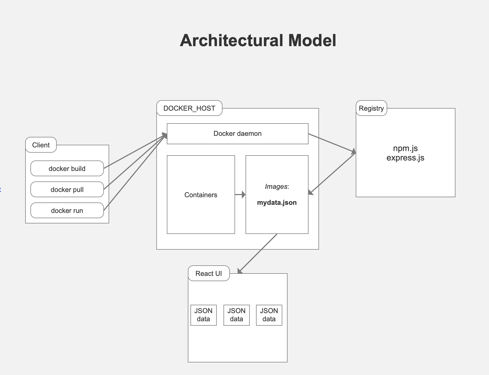

# SE577-Course-Project

## Week 9 Deliverable: `proj-Release-4`

# Getting Started with this App Instructions

### Open one cli tab for client-side project:
##### `cd SE577-Course-Project`

##### `npm install`
This command installs a package, and any packages that it depends on.

---
Create a `.env` file in the root folder and set these variables:

`REACT_APP_CLIENT_ID=Your Client ID`

`REACT_APP_CLIENT_SECRET=Your Client Secret`

`REACT_APP_REDIRECT_URI=http://localhost:3000/login`

`REACT_APP_PROXY_URL=http://localhost:5000/authenticate`

`SERVER_PORT=5000`
---

### Open 2nd cli tab within folder for Docker server

#### CLI #2 Docker server tab:
`docker run --name webserver1 -d -p 5002:5002 trevdevhq/se577-course-server:1.0.1`

###### trev's Docker Hub repo:
`https://hub.docker.com/r/trevdevhq/se577-course-server`

#### CLI #1 Course prject tab:
##### `npm start`

Runs the app in the development mode.\
Open [http://localhost:3000](http://localhost:3000) to view it in your browser.

---
## architectural model

- *__The Docker daemon__* listens for Docker API requests and manages Docker objects such as images.

- *__The Docker client__* is the primary way that many Docker users interact with Docker.

- *__A Docker registry__* stores Docker images.

- When you use the `docker pull` or `docker run` commands, the required images are pulled from the configured registry.

- An *__image__* is a read-only template with instructions for creating a Docker container.

- A *__container__* is a runnable instance of an image. You can create, start, stop, move, or delete a container using the Docker API or CLI.

- docker is used to host the API data for use in the UI:

